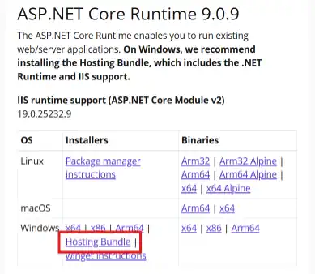
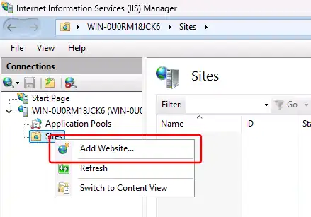
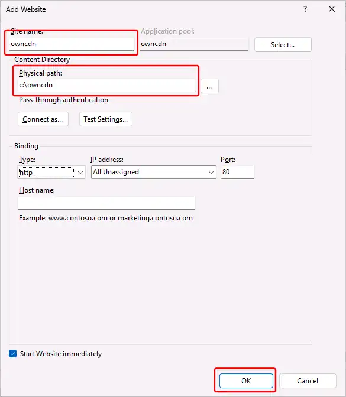
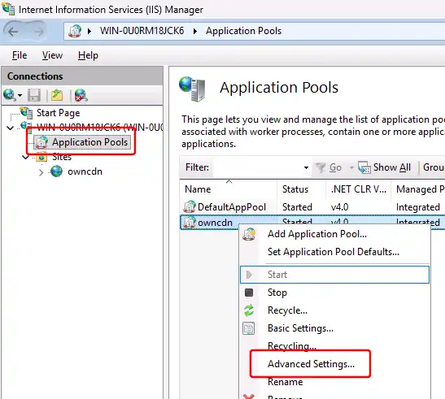
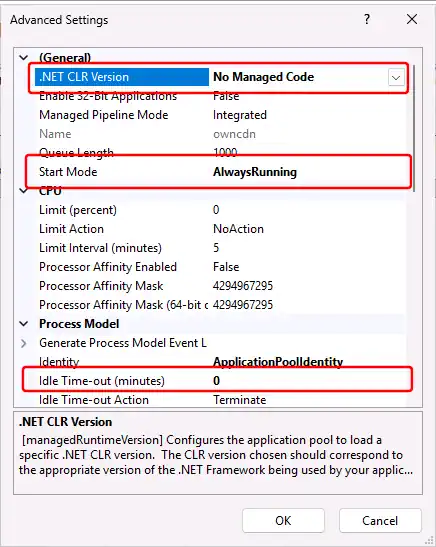
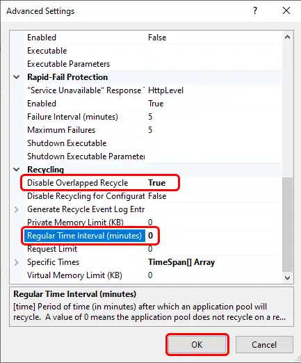
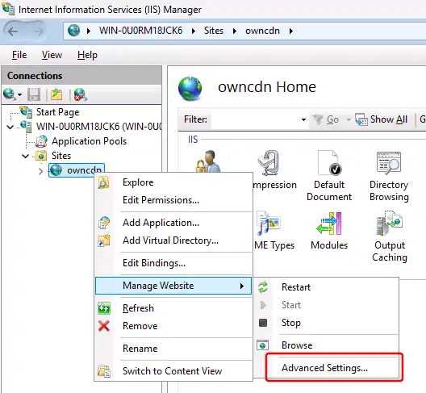
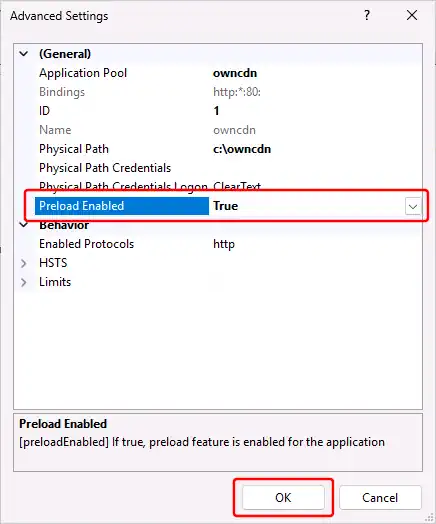
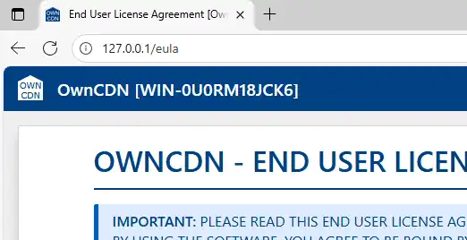

---
category: 1
VGroup: 1
VName: Windows Server 2025
VSort: 1
---
# How to install OwnCDN as an IIS web-site on Windows Server 2025 

1. First [install IIS (Internet Information Services)](12-how-to-install-iis-on-windows-server-2025.md), and make sure to enable the "Application Initialization" feature (Web Server Role (IIS) / Application Development / Application Initialization).

2. Download and install the latest "ASP.NET Core Runtime 9.x - Hosting Bundle" from  https://dotnet.microsoft.com/en-us/download/dotnet/9.0  
Make sure to select the "Hosting Bundle" file:  
  
    

    Run the "dotnet-hosting-9.0.xxx-win.exe" file.

    > [!IMPORTANT] The "ASP.NET Core Runtime 9.x - Hosting Bundle" must only be installed **AFTER** IIS is installed (see step 1).

3. Download OwnCDN (a zip file) from <https://owncdn.com/download>  

4. Extract the content of the downloaded zip file to a folder on the server computer - for example `c:\owncdn` (right-click the .zip file in File Explorer, and select "Extract All...", or use your preferred zip file program to do this).

5. Open the "Internet Information Services (IIS) Manager" from the Windows Start menu.

    > [!NOTE] To make things simpler, we removed the "Default" IIS web-site. But you can easily install OwnCDN along-side that and/or any other existing IIS web-sites. You just need to configure each web-site to use different host names or port numbers.

    Expand the tree in the left pane, right-click "Sites", and select "Add Website...":

    

6. In the "Add Website" dialog, enter "owncdn" as the Site name (note: The application name will automatically be the same - this is fine).  
Specify the folder where you extracted the OwnCDN files (see step 4) under "Physical path:".  
If needed, you can also configure the IP address, port, and/or host name here, so that OwnCDN won't conflict with any existing web-site.  
Click the "OK" button:

    

7. Back in the IIS Manager window, in the left pane, click "Application Pools", then right-click the "owncdn" application pool, and select "Advanced settings":

    

8. Under "(General)", change ".NET CLR Version" to "No Managed Code", and "Start Mode" to "AlwaysRunning".  
Under "Process Model", change "Idle Time-out (minutes)" to "0" (to prevent shutting down when idle).

    

9. Scroll down, and under "Recycling", change "Regular Time Interval (minutes)" to "0" (to prevent periodic recycling), and click the "OK" button:

    

10. Back in the IIS Manager window, in the left pane, right-click the "owncdn" web-site, select "Manage Website", and then "Advanced Settings...":

    

11. Change the "Preload Enabled" setting to "True", and click the "OK" button:

    

12. At this point you may need to restart IIS - aka the "W3SVC" / "World Wide Web Publishing Service" service.  
You can do this via the Windows Task Manager / Services tab, or at a command prompt by typing `NET STOP W3SVC` (ENTER), followed by `NET START W3SVC` (ENTER).

13. Finally, you should be able to open the OwnCDN site in your browser using `http://127.0.0.1` or whatever IP address / port / host name you configured the site to be available at.  
(The first time you open this, you will be presented with the OwnCDN EULA)

    
