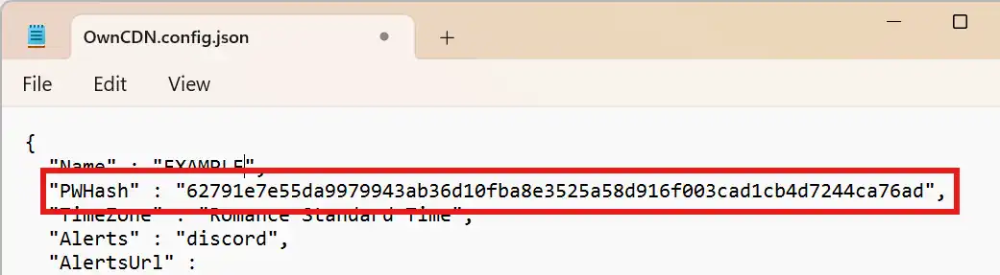

# How to reset the UI password

If you have lost / forgotten the UI password for your OwnCDN installation, you can reset this by opening the "OwnCDN.config.json" file (in the [data folder](8-how-to-set-localtion-of-data-files.md)) with a text editor, delete the "PWHash" line, re-save the file, and then restart OwnCDN.

The next time you open the OwnCDN web UI, you will be prompted to enter a new password.

