# How to install IIS on Windows Server 2025

In "Server Manager" (under "Dashboard"), click "Add roles and features":

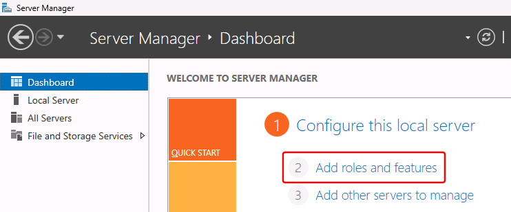

In the "Add Roles and Features Wizard" dialog, "Before you Begin" section, click the "Next" button:

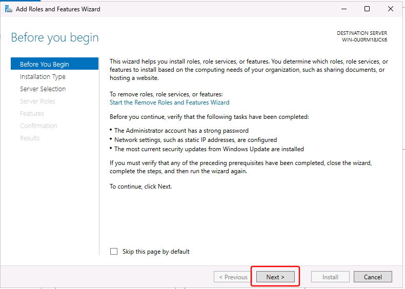

In the "Installation Type" section, select "Role-based or feature-based installation":

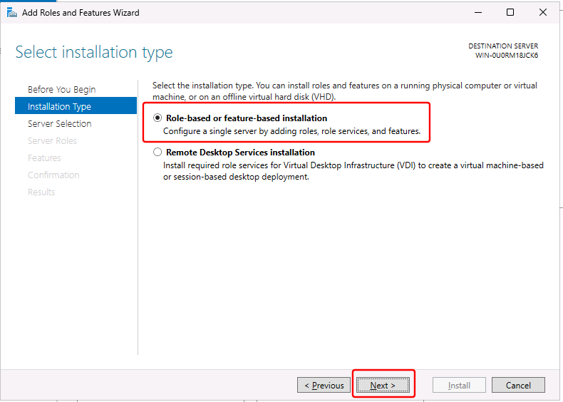

In the "Server Selection" section, select "Select a server from the server pool", select your server, and click the "Next" button:

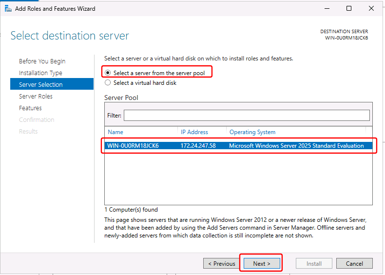

In the "Server Roles" section, select "Web Server (IIS)":

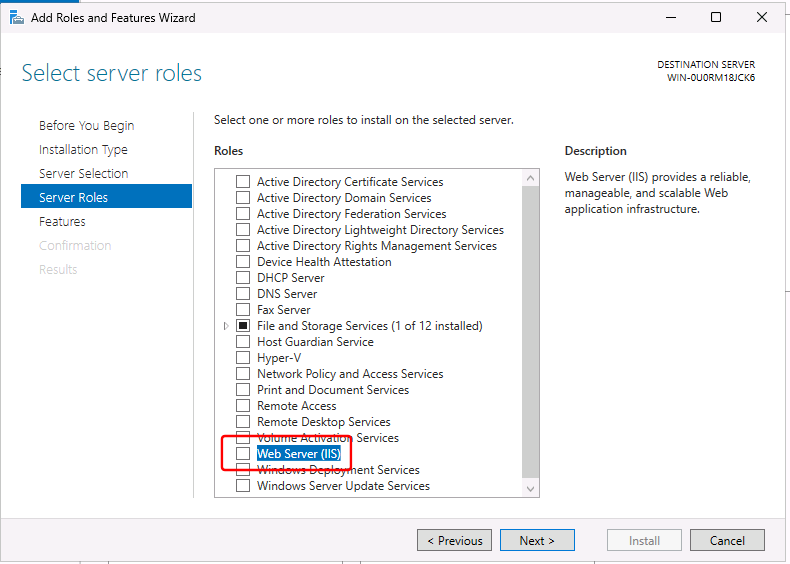

In the dialog "Add features that are required for Web Server (IIS)", click the "Add features" button:

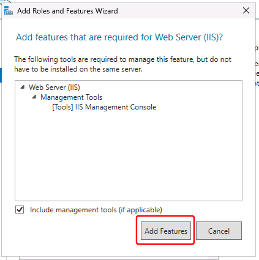

Back in the "Server Roles" section, click the "Next" button:

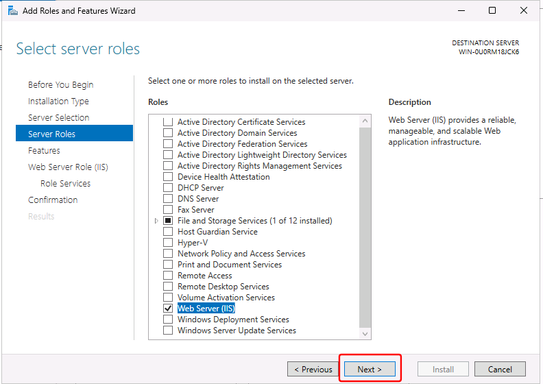

In the "Features" section, click the "Next" button:

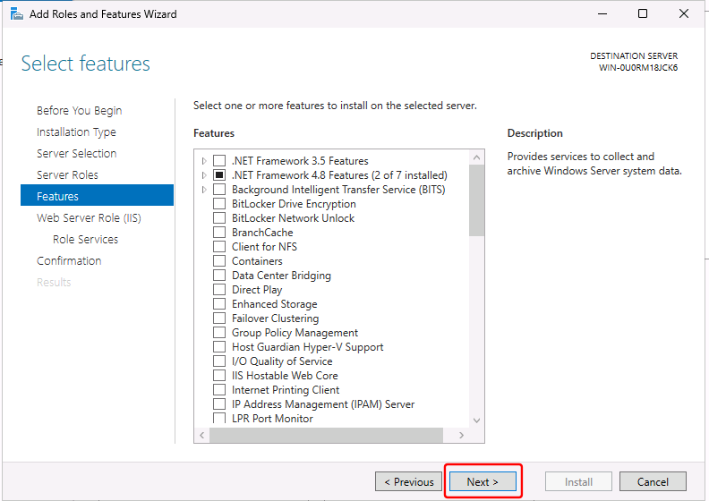

In the "Web Server Role (IIS)" section, click the "Next" button:

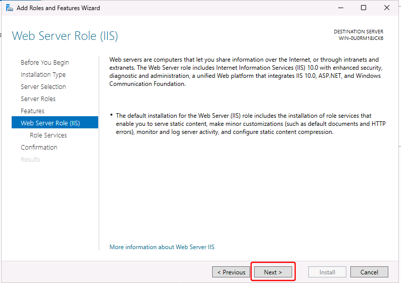

> [!NOTE] The following (enabling the "Application Initialization" feature) is needed for the "Enable preload" web-site setting to work (see instructions for installing OwnCDN) - which ensures that OwnCDN startup as soon as the application pool / website starts.

In the "Web Server Role (IIS) / Role Services" section, scroll down and expand "Application Development", and check "Application Initialization", and click the "Next" button.

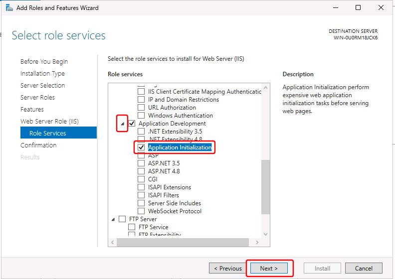

In the "Confirmation" section, click the "Install" button:

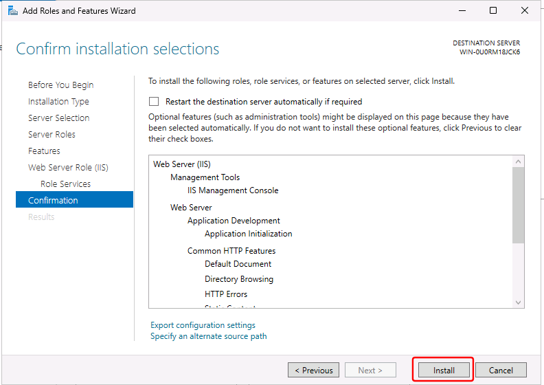

And finally, after the installation completes, click the "Close" button:

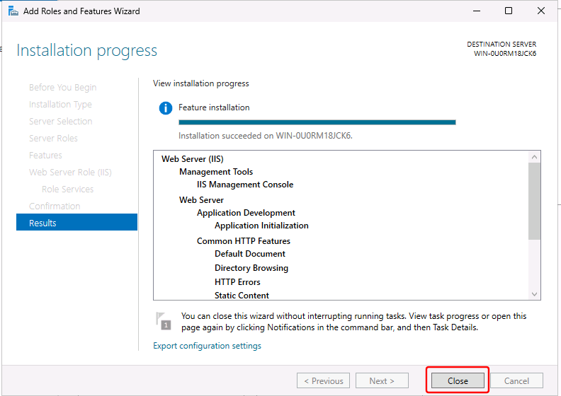

