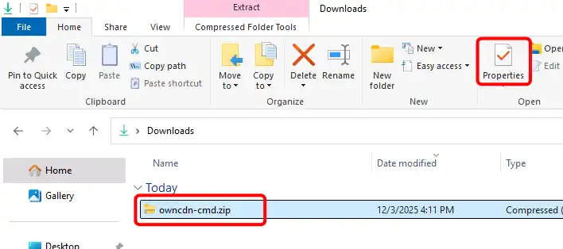
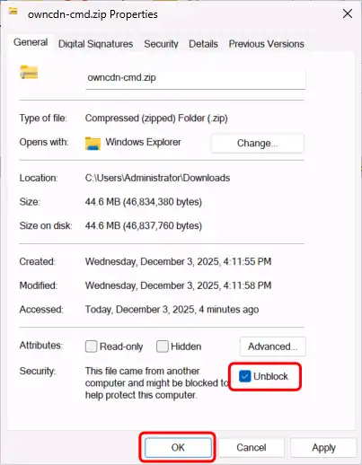
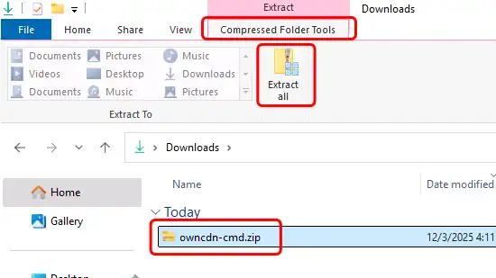
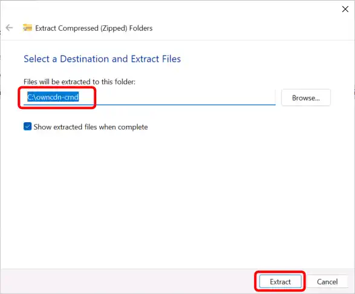
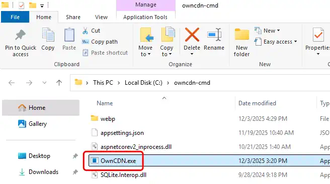
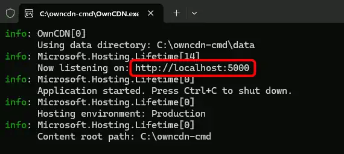
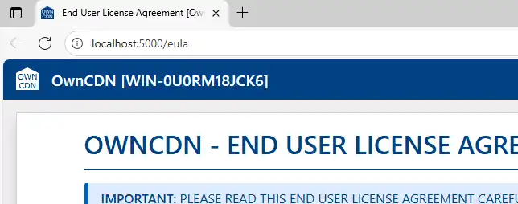

# How to run OwnCDN from the command line

> [!NOTE] We recommend running OwnCDN as an IIS web-site. See
> TODO: ...

TODO:
https://learn.microsoft.com/en-us/aspnet/core/fundamentals/servers/kestrel/endpoints?view=aspnetcore-9.0#specify-ports-only

## Unblock the downloaded file

<!-- TESTED: Server2016 + Win10 also has it -->

Open the folder where you downloaded the "owncdn-cmd.zip" file to in File Explorer, select the downloaded file, and click the "Properties" button:  
(or right-click on the file and select "Properties" from the context menu)

In the file Properties dialog, check the "Unblock" checkbox under "Security", and click the "OK" button:

## Un-zip the file

Open the folder where you downloaded the "owncdn-cmd.zip" file to in File Explorer, select the downloaded file, select the "Compressed Folder Tools" tab, and click the "Extract all" button:  
(or right-click on the file and select "Properties" from the context menu)

Specify the folder where you want the files extracted to (use a new / empty folder), and click the "Extract" button:

## Run OwnCDN

A new File Explorer window will open showing the extracted files. Double-click the "OwnCDN.exe" file:

OwnCDN will listen for HTTP requests on an available port-number (defaults to port 5000).  
Copy the address shown in the terminal window to your browser: 

The OwnCDN user interface should show up in your browser (starting with the EULA):

