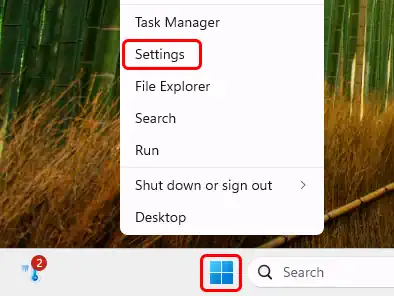
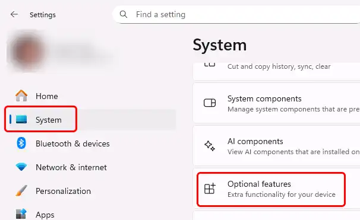
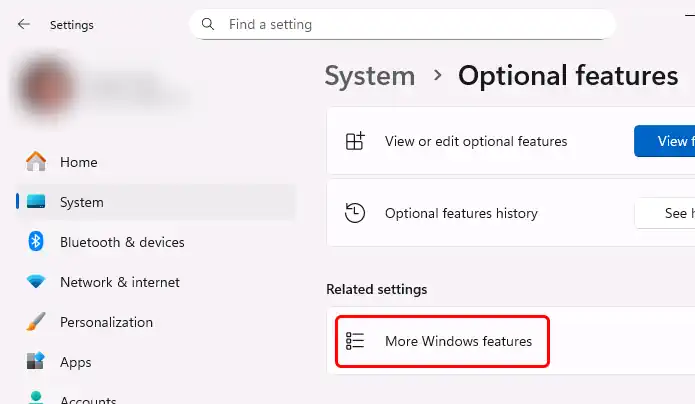
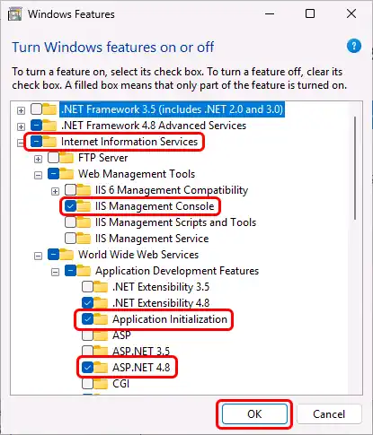
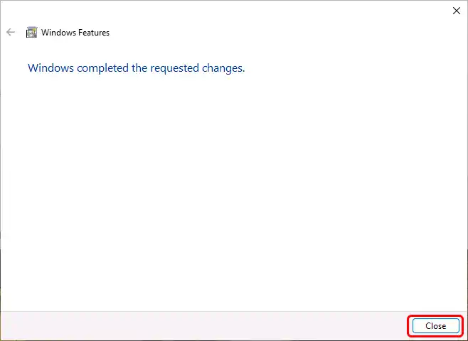
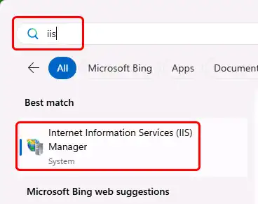

# How to enable IIS on Windows 10 / 11

> [!Note] Concurrent connections are limited for IIS on Windows Client OS versions.  
> This affects how many clients can access OwnCDN at the same time. [Click here](https://learn.microsoft.com/en-us/iis/troubleshoot/request-restrictions) for details. 

> [!Note] The following screenshots are from Windows 11 (late 2025). Things look a bit different on Windows 10 but generally have the same names.

Right-click the Windows Start icon, and select "Settings" from the pop-up menu:

In the left-side menu, click "System", scroll down to the bottom of the list and click "Optional features":

Click on "More Windows features":

Expand "Internet Intermation Services", expand "Web Management Tools" and enable "IIS Management Console", expand "World Wide Web Services", expand "Application Development Features", and enable "Application Initialization" and "ASP.NET 4.8", and click the "OK" button: 

When the installation completes, click the "OK" button:

You should now be able to open "Internet Information Services (IIS) Manager". In the Windows Start menu search for "iis" and it should come up:

