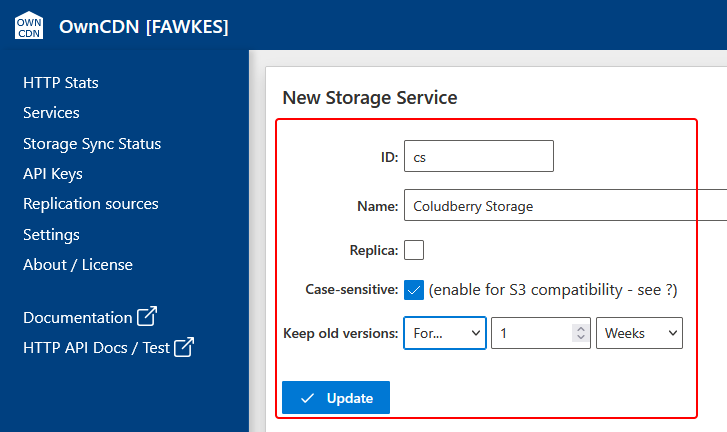
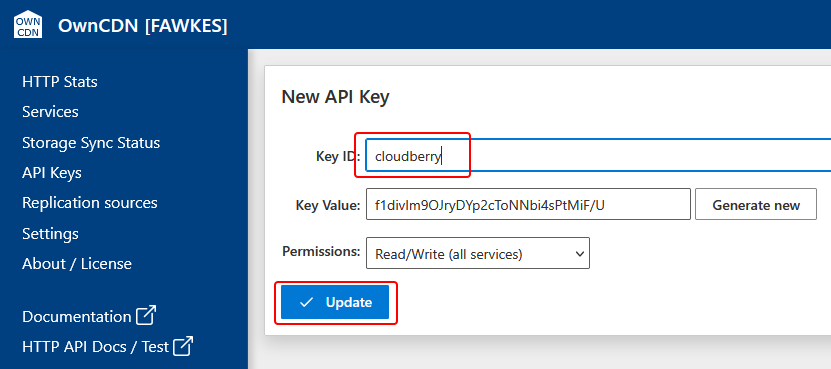
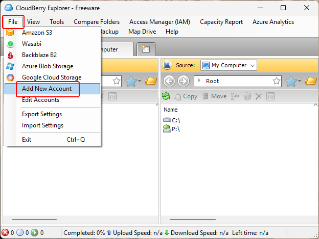
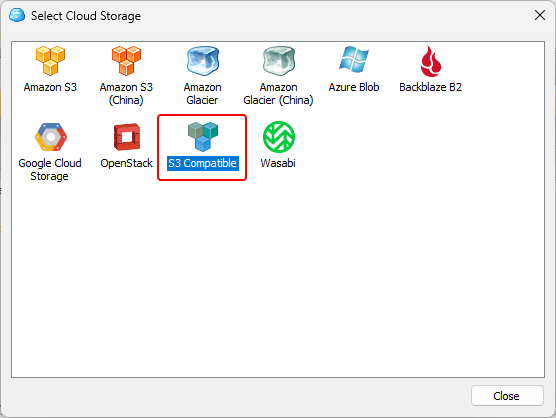
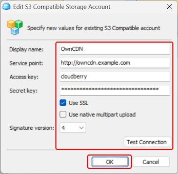
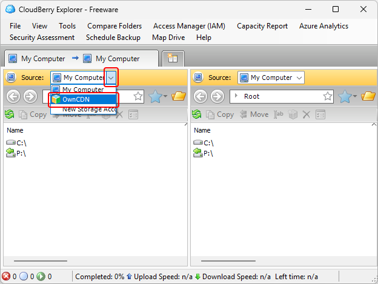
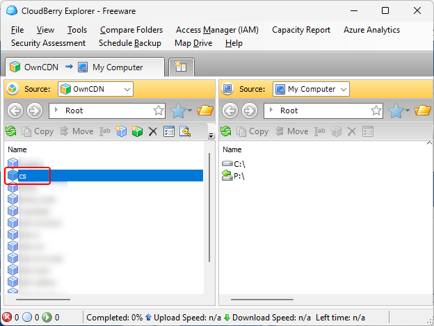
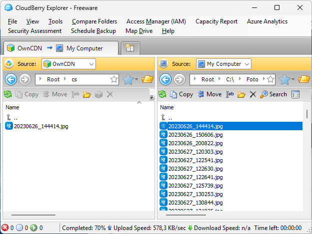

# Using OwnCDN with CloudBerry Explorer

[CloudBerry Explorer](https://www.msp360.com/explorer/) is a desktop application for Windows and Mac that can be used to "Access, move and manage files across your local storage and the cloud storage of your choice".

CloudBerry Explorer supports "S3 compatible" storage services, and thus also OwnCDN.

You can set this up with OwnCDN and use it much like Windows Explorer to move files between your computer and OwnCDN.

In the OwnCDN web interface, click on "Services" on the left side menu, click on the "New service" button and select "Storage":

Enter a service ID, Name, check Case-sensitive (IMPORTANT), specify how long to keep old versions, and click the "Update" button: 

On the left side menu, click "API Keys", and click the "New API Key" button:

Enter a Key ID and click the "Update" button:

In CloudBerry Explorer, from the "File" menu, select "Add New Account":

Double-click on the "S3 Compatible" option:

Enter the required fields in the "Edit S3 Compatible Storage Account" dialog: 
- As "Display name" enter "OwnCDN".
- As "Service point" enter the root URL where OwnCDN is running.
- As "Access key" enter the "Key ID" value from the API Key in OwnCDN.
- As "Secret key" enter the "Key Value" value from the API Key in OwnCDN.
- Un-check the "Use native multipart upload" option.
- For "Signature version" select "4".

Click the "Test Connection" button to make sure everything is correct.  
Finally, click the "OK" button:

Now select "OwnCDN" in the "Source" dropdown:

Double-click the ID of the storage service created earlier in OwnCDN:

And now you can drag and drop files forth and back, etc.:

