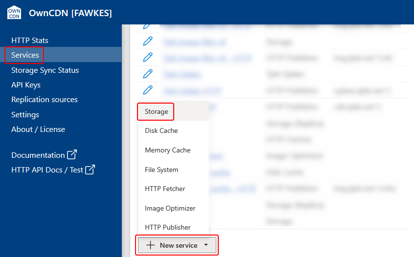
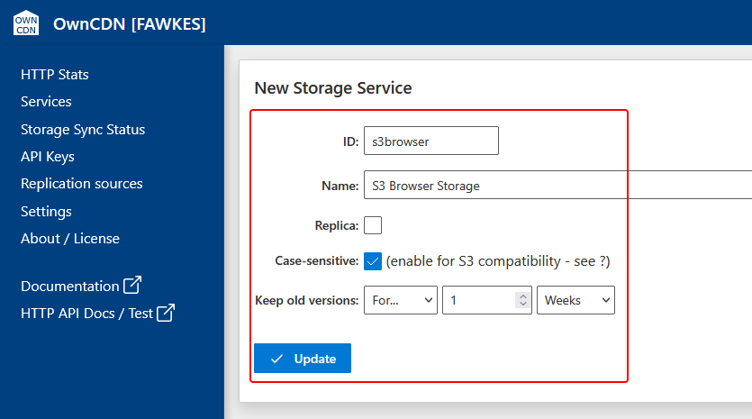
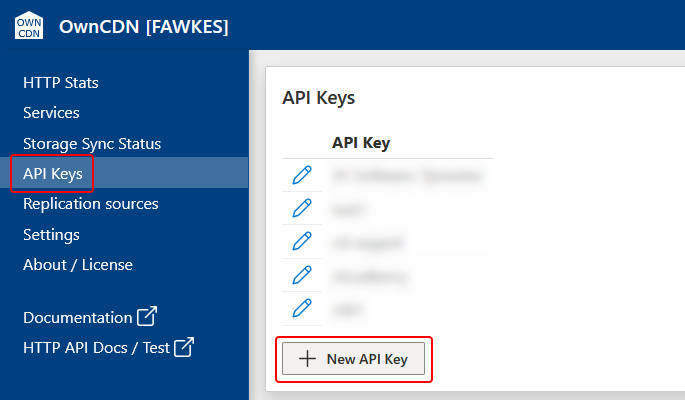
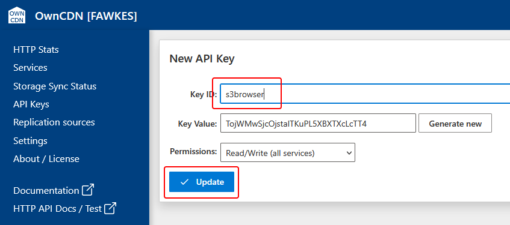
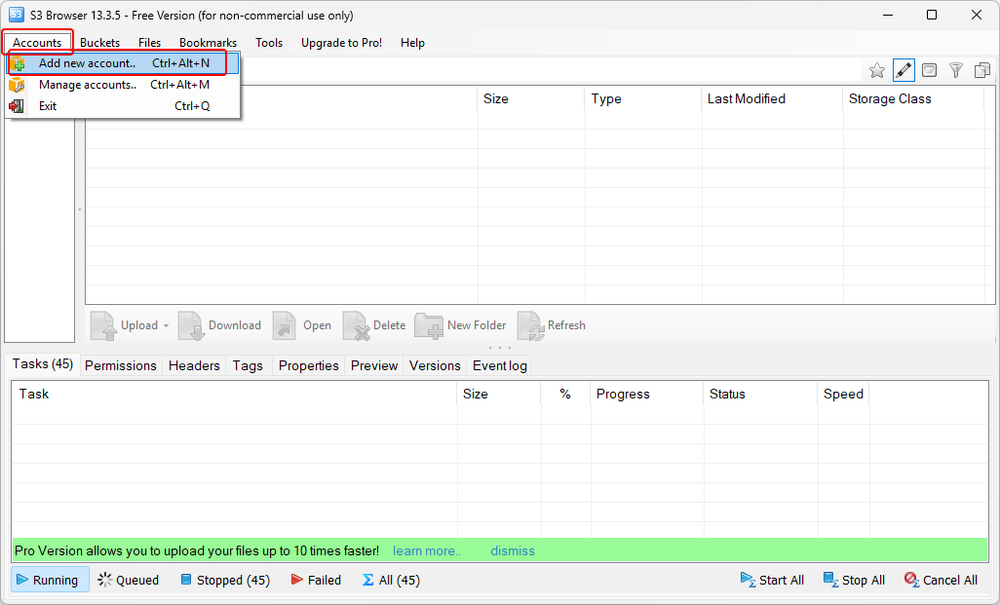
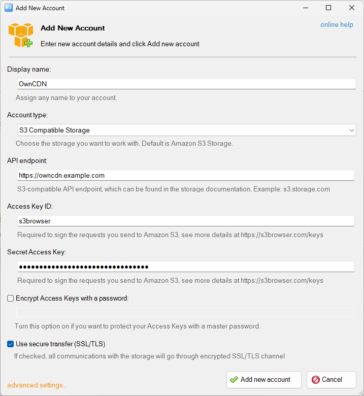
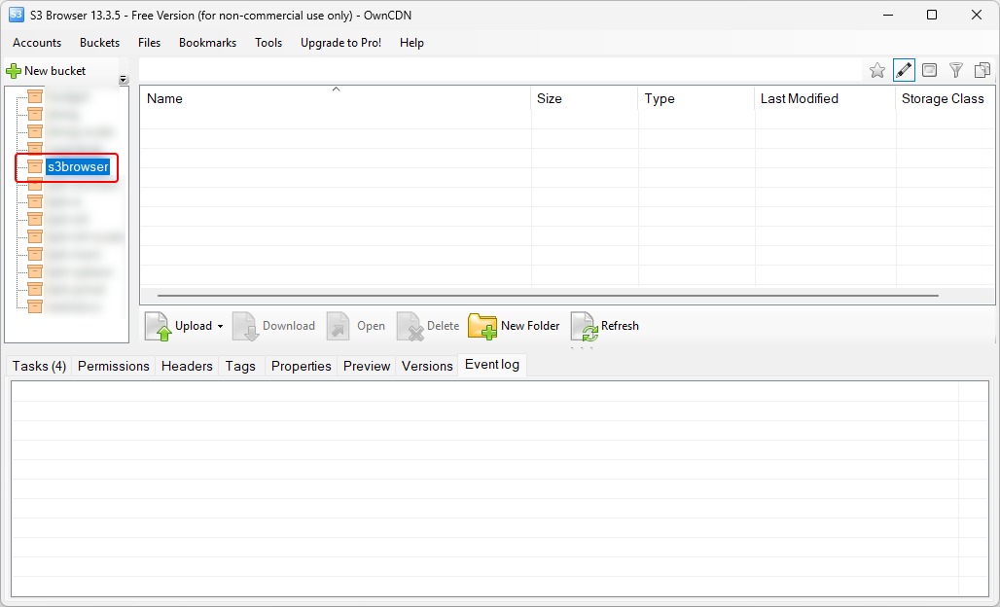
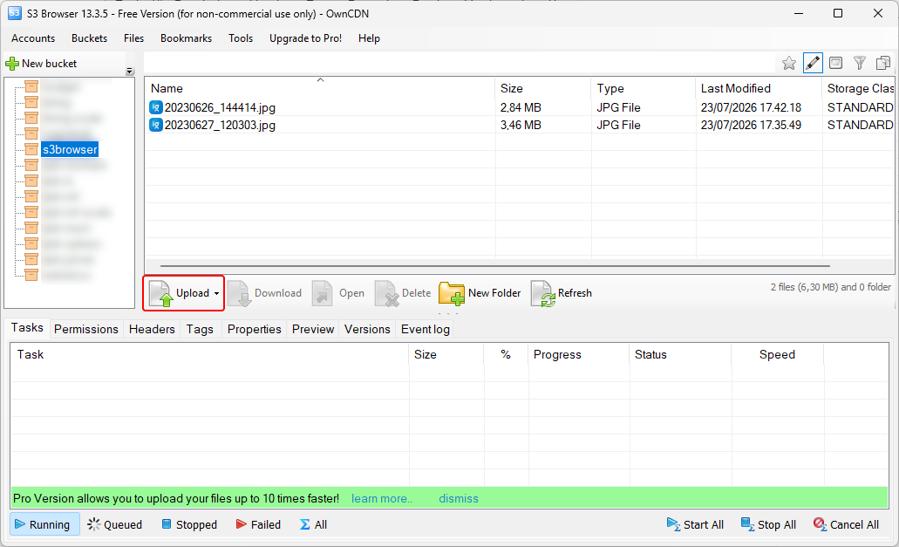

# Using OwnCDN with S3 Browser

[S3 Browser](https://s3browser.com) is "a powerful Windows client for Amazon S3 and Amazon S3-compatible cloud storage services. S3 Browser helps you work with buckets and files from a familiar Windows interface: upload and download data, manage permissions, organize objects, and handle routine storage tasks without switching to command-line tools!".

S3 Browser supports "S3 compatible" storage services, and thus also OwnCDN.

The following describes how to first set up a Storage service and an API key in OwnCDN, and then how to connect to that storage and manage files using S3 Browser.

You can set this up with OwnCDN and use it much like Windows Explorer to move files between your computer and OwnCDN.

In the OwnCDN web interface, click on "Services" on the left side menu, click on the "New service" button and select "Storage":

Enter a service ID, Name, check Case-sensitive (IMPORTANT), specify how long to keep old versions, and click the "Update" button: 

On the left side menu, click "API Keys", and click the "New API Key" button:

Enter a Key ID and click the "Update" button:

In S3 Browser, from the "Accounts" menu, select "Add new account...":

Enter the required fields in the "Add New Account" dialog.

- As "Display name" enter "OwnCDN".
- As "Account type" select "S3 Compatible Storage".
- As "API endpoint" enter the root URL where OwnCDN is running (make sure NOT to include an ending / character).
- As "Access Key ID" enter the "Key ID" value from the API Key in OwnCDN.
- As "Secret Access key" enter the "Key Value" value from the API Key in OwnCDN.

Finally, click the "Add new account" button:  

Now the storage services from OwnCDN should show up in the list. Click the storage service created for this:

Now you can use the "Upload" button to upload files, etc.:

