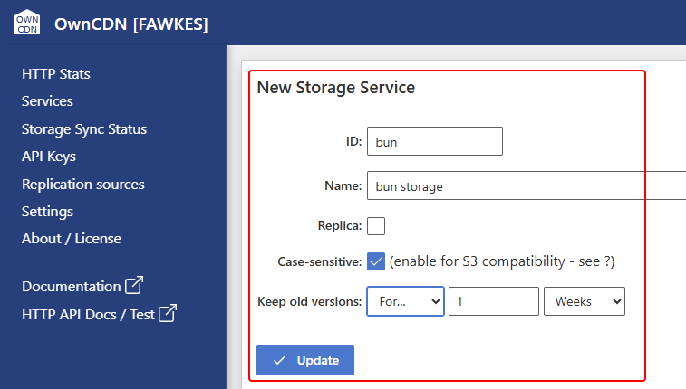
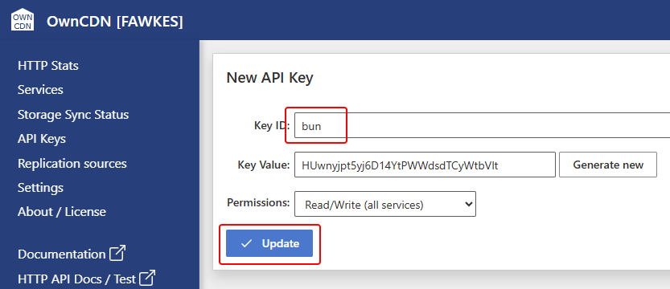

# Using OwnCDN with JavaScript run with Bun

[Bun](https://bun.com) is a JavaScript runtime (like Node.js) - amongst other things.

Bun has built-in support for S3 and S3 compatible storage - and thus also OwnCDN.

The following describes how to first set up a Storage service and an API key in OwnCDN, and then how to write and read files to/from that storage using JavaScript run with Bun.

In the OwnCDN web interface, click on "Services" on the left side menu, click on the "New service" button and select "Storage":


Enter a service ID, Name, check Case-sensitive (IMPORTANT), specify how long to keep old versions, and click the "Update" button: 



On the left side menu, click "API Keys", and click the "New API Key" button:


Enter a Key ID and click the "Update" button:



Next, create a JavaScript file like the following.


```javascript
/* test.js */

import { S3Client } from "bun";

const client = new S3Client({
  endpoint: "https://owncdn.example.com",
  bucket: "bun",
  accessKeyId: "bun",
  secretAccessKey: "HUwnyjpt5yj6D14YtPWWdsdTCyWtbVlt",
});

// A lazy reference to a file on OwnCDN
const s3file = client.file("test-file.txt");

// Write a test file to OwnCDN
await s3file.write("Hello World!");

// Read the test file back
const text = await s3file.text();
console.log(text);
```

- Replace the "endpoint" value with the root URL where OwnCDN is running.
- Replace the "bucket" value with the ID of the Storage service in OwnCDN.
- Replace the "accessKeyId" value with the "Key ID" value from the API Key in OwnCDN.
- Replace the "secretAccessKey" value with the "Key Value" value from the API Key in OwnCDN.

Now, run the script using:

```
bun test.js
```

You don't need any other libraries, and you don't need to build or bundle anything.

For more details on using the S3 features in Bun - see 
<https://bun.com/docs/runtime/s3>