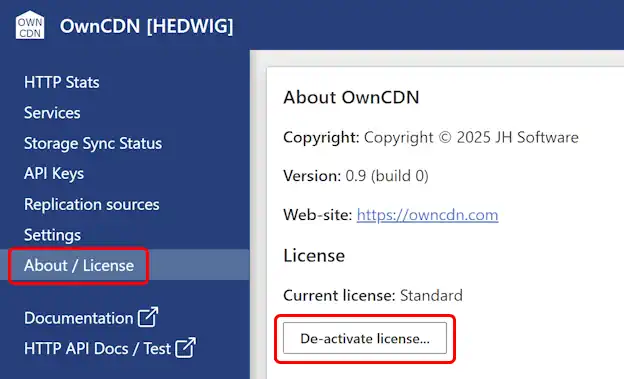

# How to move OwnCDN to another computer

To move your OwnCDN installation including settings and data, you first need to back up your data and settings - [click here for details](/kb/7).

Then install Simple DNS Plus on the new computer and restore the data and settings (see link above).

### Licensing

It is **not** allowed to use the same license key on more computers than licensed for - for any period of time, no matter how short this may be.

Therefore, if your OwnCDN license is activated on the old computer, you need to de-activate OwnCDN on the old computer (un-install or delete files), before you activate the license on the new computer.

You can de-activate the license from the OwnCDN web UI, under "About / License", clicking the "De-activate license..." button:

If you need to run both the old and the new OwnCDN instances during a transition period, you can use a trial license on the new computer during this time.

