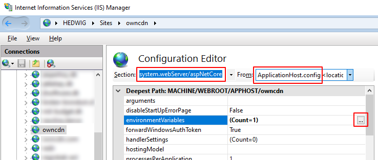
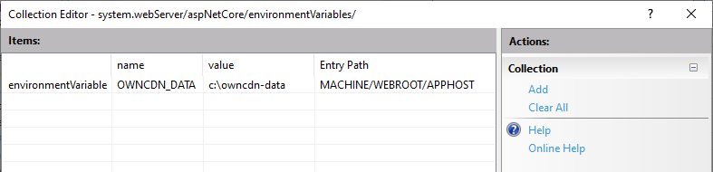

---
Category: 1
---
# How to configure location of data files

TODO: make sure write access to folder...


By default, OwnCDN stores its data files in a "data" sub-folder under the folder from where OwnCDN is installed (where the "OwnCDN.exe" file is).

This can be changed either by setting the environment variable "DATA_DIR" to the full path of the data folder, or by adding a "DATA_DIR" setting to the "appsettings.json" file (in the folder where OwnCDN.exe is located).

## Using environment variable

### Running "directly"

TODO: ...

### Running under IIS

If you have mulitple instances of OwnCDN, you can set this at a web-site level.

Do the following for each OwnCDN site in IIS:

In IIS Manager, select the OwnCDN site, under "Management" double click "Configuration Editor".

Under "Section" select "system.webServer/aspNetCore", and under "From" select "ApplicationHost.config", click the "..." button next to "environmentVariables":  



In the "Collection Editor" window, click then "Add" link and add a value for "DATA_DIR" with a value of the data folder: 

TODO: REPLACE SCREENSHOT (OWNCDN-DATA -> DATA_DIR)



TODO: ... click "Apply".... (TODO)


## Using "appsettings.json"

Edit the "appsettings.json" file in the folder where OwnCDN.exe is located, and add a "DATA_DIR" setting with the location of the data files:

```json
{
  "Logging": {
    "LogLevel": {
      "Default": "Information",
      "Microsoft.AspNetCore": "Warning"
    }
  },
  "AllowedHosts": "*",
  "DATA_DIR": "e:\data\owncdn"
}
```

> [!Caution]
> If at some point you update OwnCDN to a newer version, make sure that you don't overwrite the "appsettings.json" file - or that you re-add this setting.
 
