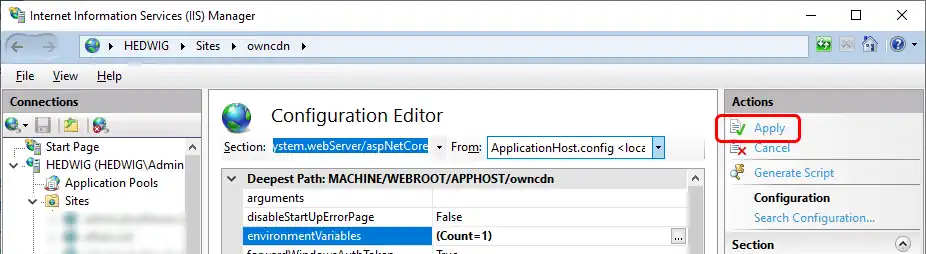

# How to configure location of data files

> [!Important] Make sure that the OwnCDN process (app pool identify if under IIS) has write access to the data folder that you specify.

By default, OwnCDN stores its data files in a "data" sub-folder under the folder from where OwnCDN is installed (where the "OwnCDN.exe" file is).

This can be changed by updating the "data_dir" setting in the "appsettings.json" file, by setting the environment variable "DATA_DIR", or by using the `--data_dir` command line option (when running from the command line):

## Using "appsettings.json"

Edit the "appsettings.json" file in the folder where OwnCDN.exe is located, and update the "data_dir" setting with the location of the data files:

```json
{
  "Logging": {
    "LogLevel": {
      "Default": "Information",
      "Microsoft.AspNetCore": "Warning"
    }
  },
  "AllowedHosts": "*",
  "data_dir": "e:\data\owncdn"
}
```

> [!Caution]
> If at some point you update OwnCDN to a newer version, make sure that you don't overwrite the "appsettings.json" file - or that you re-add this setting.


## Using environment variable

You can set the data folder location using the "DATA_DIR" environment variable (which is not vulnerable to appsettings.json file overwrite at update).

> [!Caution] Setting the "DATA_DIR" environment variable in any way, overides the "data_dir" setting in the appsettings.json file.

### Running under IIS

When running one or more instances of OwnCDN [under IIS](/kb/1), you can set the data location for each instance at a web-site level.
Do the following for each OwnCDN site in IIS:

In IIS Manager, select the OwnCDN site, under "Management" double click "Configuration Editor".

Under "Section" select "system.webServer/aspNetCore", and under "From" select "ApplicationHost.config", click the "..." button next to "environmentVariables":  


In the "Collection Editor" window, click then "Add" link and add a value for "DATA_DIR" with a value of the data folder: 


Click the "Collection Editor" window, and make sure to click "Apply" back in the main IIS window:




### Running from command line
 
When [running OwnCDN from command line](/kb/13), you can set the location of the data files (before running owncdn.exe) by typing `set DATA_DIR=e:\data\owncdn` or use `setx` to configure a permanent environment variable (type `setx /?` for usage).

## Using command line option

When [running OwnCDN from command line](/kb/13), you can set the location of the data files using the command line option `--data_dir` like this:

`owncdn.exe --data_dir C:\owncdn-data`

> [!Note] Using the "--data_dir" command line option, overides both the "data_dir" setting in the "appsettings.json" file, and the "DATA_DIR" environment variable.
